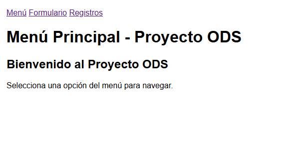
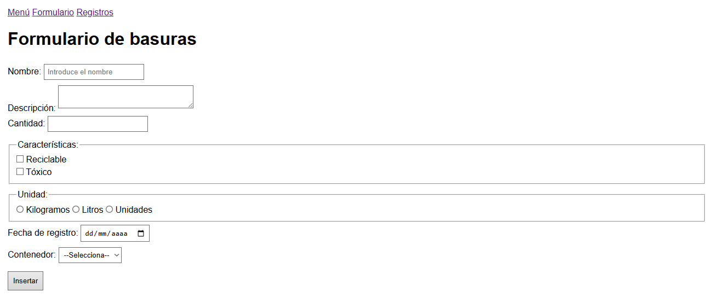
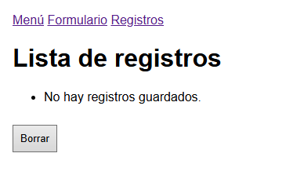

# Proyecto ODS - Equipo Alfa

Proyecto grupal destinado a la asignatura de Programación para la titulación de DAW1.

## Descripción del Proyecto

El proyecto consiste en el desarrollo de un juego web con temática de los ODS (Objetivos de Desarrollo Sostenible). El objetivo es crear una experiencia interactiva que eduque y conciencie sobre los objetivos globales de desarrollo sostenible de las Naciones Unidas.

## Tecnologías Utilizadas

- **HTML5**: Estructura de la página web.
- **CSS3**: Estilos y diseño visual.
- **JavaScript**: Lógica del juego y funcionalidades interactivas.

## Cómo Ejecutar el Proyecto

1. Clona o descarga el repositorio.
2. Abre el archivo `fuentes/index.html` en tu navegador web preferido.
3. Navega por el menú, registra jugadores y disfruta del juego.

## Miembros del Equipo

- Felipe Almeida
- Sergio Seller
- Javier Blanco

## Backlog del Proyecto

Para ver el backlog completo con las tareas técnicas, consulta el archivo [fuentes/backlog.md](fuentes/backlog.md).
## CRUD

| Tarea | Descripción | Trabajador | Estado |
|-------|-------------|------------|--------|
| TT1 | Documentación y Estructura | JAVI | COMPLETADO |
| TT2 | Backlog | FELIPE | COMPLETADO |
| TT3 | Creación de CRUD | SERGIO | EN PROCESO |
| TT4 | Acciones/Eventos | JAVIER | EN PROCESO |
| TT5 | Vistas | FELIPE | EN PROCESO |
| TT6 | Manual de Usuario | - | ASIGNANDO |

## Juego

| Tarea | Descripción | Trabajador | Estado |
|-------|-------------|------------|--------|
| TT7 | Arreglar el CRUD / Arreglar el Backlog | - | ASIGNANDO |
| TT8 | Crear un CSS para la Página (No Juego) | - | ASIGNANDO |
| TT9 | Organizar/Seleccionar Imágenes | - | ASIGNANDO |
| TT10 | Crear Campo de Juego | - | ASIGNANDO |
| TT11 | Crear Colisiones | - | ASIGNANDO |
| TT12 | Insertar Imágenes en el Juego | - | ASIGNANDO |
| TT13 | Primeras Interacciones | - | ASIGNANDO |
| TT14 | CSS (Juego) | - | ASIGNANDO |
| TT15 | Jugadores | - | ASIGNANDO |
| TT16 | Puntuaciones | - | ASIGNANDO |
| TT17 | Registro de Puntuación | - | ASIGNANDO |

## Situación Gráfica del Proyecto

### Menú

### Formulario

### Registro

## Certificación

