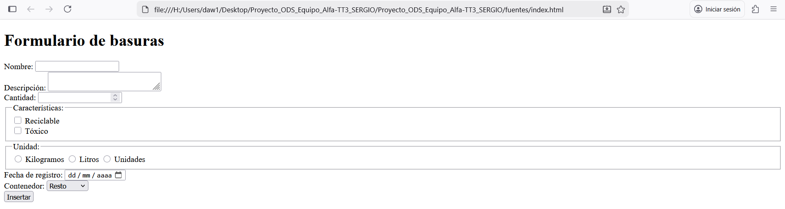
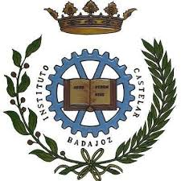

# Proyecto_ODS_Equipo_Alfa
Proyecto grupal destinado a la asignatura de Programación para la titulación de DAW1.
## ¿ De qué trata el proyecto ?
El proyecto consiste en el desarrollo de un juego con temática de los ODS (Objetivos de Desarrollo Sostenible).
## BACKLOG
## BACKLOG

REQUERIMIENTOS TÉCNICOS

    TT1 - DOCUMENTACIÓN Y ESTRUCTURA                                                  JAVI      |
    TT2 - BACKLOG                                                                     FELIPE    | 
    TT3 - CREACIÓN DE CRUD                               				              SERGIO    |
# MIENBROS DEL EQUIPO
- Felipe Almeida
- Sergio Seller 
- Javier Blanco
# SIUACIÓN GRAFICA DELPROYECTO 
()
# CERTIFICACIÓN
()
